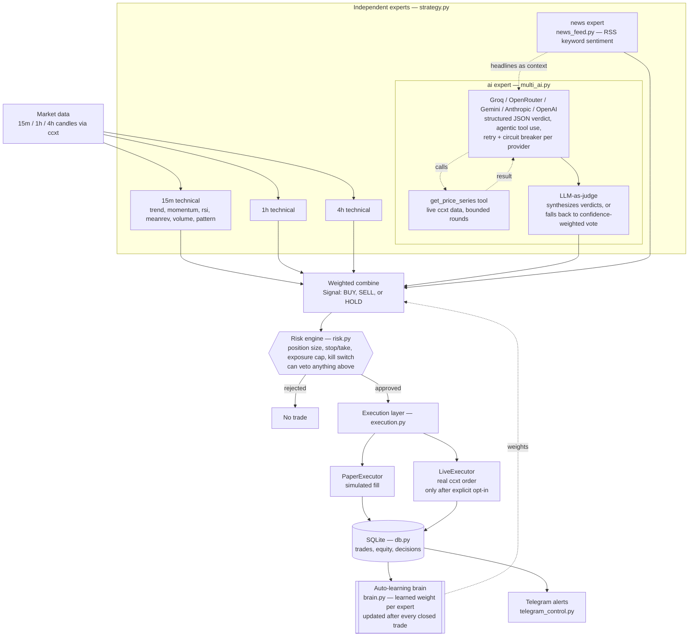

# ZORA Advanced Pocket Trader (Termux edition)

[](https://github.com/YOUR_USERNAME/zora_advanced_bot/actions/workflows/ci.yml)
[](LICENSE)
[](pyproject.toml)

A multi-timeframe, multi-factor, multi-symbol crypto trading bot designed to
run on a phone via Termux. Paper trading by default — no real money moves
unless you deliberately unlock the `live` command.

*(the CI badge above will go green once you push this to your own repo — see
[Git](#git) below; it's inert until then)*

## Contents

- [What's "advanced" about this version](#whats-advanced-about-this-version)
- [Architecture](#architecture)
- [Setup (Termux)](#setup-termux)
- [Usage](#usage)
- [Telegram (optional)](#telegram-optional)
- [Going live](#going-live)
- [Development & testing](#development--testing)
- [Please read before you trust any of this with real money](#please-read-before-you-trust-any-of-this-with-real-money)
- [Git](#git)

## What's "advanced" about this version

- **Multi-timeframe ensemble**: scores 15m / 1h / 4h independently, weights
  higher timeframes more, then combines them — so a short-term blip can't
  override a bigger trend.
- **Multi-factor scoring**: EMA trend stack, MACD momentum, RSI, Bollinger
  mean-reversion, volume confirmation, and classic chart pattern recognition
  (see below), combined transparently instead of a single opaque "AI says
  buy" black box.
- **Chart pattern recognition** (`patterns.py`): candlestick patterns
  (engulfing, hammer/hanging man, shooting star, doji, morning/evening
  star) and swing-based patterns (double top/bottom, head & shoulders and
  its inverse, support/resistance breakouts with volume confirmation) —
  all read straight off the same OHLCV candles the technical experts
  already use, no extra API calls. Confirmed vs. merely-possible patterns
  score differently (e.g. a double top only scores heavily once price
  actually breaks the trough between the two peaks), and detected pattern
  names are logged whenever one fires, not just silently folded into a
  number. Triangles, wedges, and flags are a deliberate scope line — they
  need trendline fitting to detect reliably, which is a lot more code for
  the most subjective patterns to begin with. This becomes the "pattern"
  factor, learned by the brain exactly like every other factor here.
- **Independent risk engine**: position sizing from ATR volatility + a fixed
  risk-per-trade percentage, plus hard kill switches for daily loss and
  drawdown, and a real exposure cap shared across every symbol you trade.
  The risk engine can veto any signal; no signal, AI opinion, or learned
  weight can override it.
- **Multi-AI expert panel** (`multi_ai.py`) — four things that separate this
  from "ask five chatbots and average the votes":
  1. **Structured output**, not regex-parsed prose: every provider is asked
     for a JSON verdict via its own native mechanism (Anthropic forced
     tool-calling, OpenAI/Groq `json_object` mode, Gemini `responseSchema`),
     with a legacy text-format parser as a last-resort fallback so an
     uncooperative model degrades gracefully instead of crashing the cycle.
  2. **Agentic tool use**: Anthropic and the OpenAI-compatible providers
     (Groq, OpenRouter, OpenAI) can call a real `get_price_series` tool
     against live market data before answering, bounded to a couple of
     rounds so it can't stall the trading loop. (Gemini's function-calling
     wire format differs enough that it gets structured JSON only, not the
     agentic loop — a deliberate, documented scope line.)
  3. **LLM-as-judge**: when 2+ providers answer, their individual verdicts
     go to one judge provider (`AI_JUDGE_PROVIDER`, or whichever answered)
     to weigh and synthesize into one final call, instead of just averaging
     votes. If the judge is unavailable, this falls back to
     confidence-weighted vote averaging automatically.
  4. **Resilience**: one immediate retry on a transient error, then a
     circuit breaker — a provider that keeps failing gets a cooldown so a
     dead/rate-limited endpoint isn't hammered every poll cycle, and a
     real `Retry-After` header sets that cooldown precisely when given.

  Groq, OpenRouter, and Gemini all have a genuine no-card free tier as of
  this writing, plus optional paid Anthropic/OpenAI. Every provider is
  queried in parallel once per symbol per cycle; the synthesized result
  becomes the **"ai" expert** below.
- **News/sentiment feed** (`news_feed.py`): pulls recent headlines from
  public RSS feeds (CoinDesk, CoinTelegraph — no API key, no quota to run
  out of), keyword-scores them for the coin you're trading, and becomes the
  **"news" expert**. The same matched headlines are also handed to the AI
  panel as context, so an LLM opinion is grounded in an actual recent
  headline instead of guessing blind.
- **Auto-learning brain** (`brain.py`): after every closed trade (paper,
  `learn`, or live), it nudges how much the strategy trusts each of the five
  experts (15m / 1h / 4h / ai / news) and each technical factor, based on
  whether leaning on them actually paid off. Simple, inspectable
  "multiplicative weights" online learning — no heavy ML dependencies,
  weights saved to human-readable `brain_state.json`. It only changes which
  *signal* gets generated; it never touches position sizing or the kill
  switches, which stay fixed in `risk.py` regardless of what the brain or
  any expert has said.
- **Multi-symbol portfolio mode**: `SYMBOLS` in `.env` trades several coins
  at once from one shared equity pool — `MAX_EXPOSURE_PCT` caps total risk
  across all of them combined, not per-symbol.
- **Telegram alerts + remote control** (`telegram_control.py`, both
  optional): trade alerts pushed to your phone, plus `/status /pause
  /resume /kill /brain` commands you can send from anywhere — including a
  kill switch that works even if the Termux session itself is unreachable.
- **Real live-order execution** (`execution.py`): when explicitly unlocked
  (see below), places actual orders via ccxt — precision/minimum-size
  checked, a client order ID for idempotency, and a retry only on pure
  network errors, never on an ambiguous or rejected response. Still gated
  by the exact same risk engine as paper mode.
- **Structured logging** (`logging_setup.py`): console + rotating log file
  (size-capped, so it won't slowly eat phone storage), configurable via
  `LOG_LEVEL`/`LOG_FILE` in `.env`.
- **SQLite logging**: every decision (approved or rejected) and every trade,
  across every symbol, so you can audit what happened and why.
- **Type-hinted throughout**, with a real test suite (`tests/`, run via
  `pytest`) and CI on every push — see
  [Development & testing](#development--testing).

## Architecture



Every arrow into **Weighted combine** is a vote; only the **brain** decides
how loud each vote is, and only the **risk engine** decides whether a trade
happens at all. No expert — technical, AI, or news — can skip the risk gate.

## Setup (Termux)

```bash
unzip zora_advanced_bot.zip
cd zora_advanced_bot
bash setup_termux.sh
```

Edit `.env` (copied from `.env.example`) to set your symbols, exchange, risk
parameters, and any of the optional AI/Telegram keys.

On a PC/VPS instead of Termux, you can also install it as a proper package:

```bash
pip install -e .
zora backtest   # the console script installed by pyproject.toml
```

## Usage

```bash
python bot.py backtest [SYMBOL]   # rule-based strategy over history (brain untouched)
python bot.py learn [SYMBOL]      # same replay, but lets the auto-learning brain update
python bot.py brain               # show the brain's current learned weights
python bot.py run                 # paper-trading loop across every symbol in SYMBOLS
python bot.py status              # equity / trade summary
```

(`zora backtest`, `zora run`, etc. work identically if you installed via `pip install -e .`.)

`backtest`/`learn` always run technical-only on one symbol (`SYMBOL` in
`.env`, or pass one on the command line) — there's no way to replay what an
LLM or a news feed looked like at a past candle. `run`/`live` trade every
symbol in `SYMBOLS` and query the AI/news experts for each one every cycle.

Recommended order for a new setup: run `learn` a few times on recent history
so the brain isn't starting from flat defaults, check `brain` to see what it
settled on, then `run` (paper) and watch it keep adjusting as real trades
close. Delete `brain_state.json` any time you want to reset it to defaults.

## Telegram (optional)

1. Message **@BotFather** on Telegram → `/newbot` → follow the prompts → you
   get a token like `123456789:AA...`.
2. Message your new bot anything once, so it can see your chat.
3. Visit `https://api.telegram.org/bot<YOUR_TOKEN>/getUpdates` in a browser
   and read off the numeric `"chat":{"id": ...}` — that's your
   `TELEGRAM_CHAT_ID`.
4. Put both in `.env`.

Only messages from that exact chat ID are ever acted on — anyone else
messaging your bot is silently ignored.

## Going live

`python bot.py live` only becomes usable once **all** of these are true in
`.env`: `LIVE_TRADING=true`, `I_UNDERSTAND_THE_RISK=true`, and real
`EXCHANGE_API_KEY` / `EXCHANGE_API_SECRET`. Even then it prints the risk
parameters and requires you to type `I ACCEPT THE RISK` before placing a
single order.

What live mode actually does, and its real limitations:

- Uses the identical risk engine, auto-learning brain, and AI/news experts
  as paper mode — paper mode is a faithful rehearsal of what live mode will
  do, not a separate simplified path.
- Stops and take-profits are **software-monitored**: the bot checks price
  against them each poll cycle and fires a real closing order when hit.
  They are *not* exchange-native bracket/OCO orders. If the bot stops
  running — phone dies, Termux gets killed, network drops — any open
  position has **no protection** until it's running again. Consider also
  placing a manual stop-loss order on the exchange itself as a backup, and
  use the Telegram `/kill` command if you need to halt remotely.
- A single retry is attempted only for a pure network-level failure before
  any response is received; anything else (rejected order, insufficient
  balance) is reported, not retried, so the bot can't double an order whose
  actual outcome is unknown.
- There is no crash-recovery reconciliation against your exchange balance on
  restart — if the bot restarts while a position is open, check your
  exchange account manually before assuming the bot's tracked state is
  accurate.
- Start with the smallest size your exchange allows while you build
  confidence in the wiring, independent of whether you trust the strategy.

## Development & testing

```bash
pip install -r requirements-dev.txt   # or: pip install -e .[dev]
pytest -v                             # 100+ tests across every module
ruff check .                          # lint
```

Every module is unit-tested in isolation:

| Module | Tests cover |
|---|---|
| `indicators.py` | EMA/RSI/MACD/ATR/Bollinger/volume-spike correctness on known series |
| `patterns.py` | every candlestick/swing pattern on constructed OHLCV, confirmed vs. possible states, swing-point edge cases (flat plateaus, uneven shoulders) |
| `risk.py` | position sizing, stop/take placement, exposure gate, both kill switches |
| `brain.py` | the multiplicative-weights update rule, bounds, persistence, corrupt-file recovery |
| `strategy.py` | expert combination, HOLD-on-insufficient-data, AI/news folded in correctly |
| `multi_ai.py` | JSON/legacy verdict parsing, tool execution, circuit breaker + retry, judge synthesis vs. fallback averaging, the OpenAI-style and Anthropic agentic tool-call loops |
| `news_feed.py` | keyword scoring, symbol matching/aliases, caching, one feed failing doesn't block another |
| `telegram_control.py` | the chat-ID security filter (a stranger's commands must never leak through) |
| `execution.py` | precision/minimum-size handling, network-error retry-once, hard rejections never retried |
| `db.py` | schema creation, trade/decision logging, summary aggregation |
| `config.py` | env parsing helpers, `SYMBOLS`/`TIMEFRAMES` defaults, `live_allowed()` gating |

`tests/conftest.py` provides an `isolated_brain` fixture (an `AdaptiveBrain`
backed by a throwaway temp file) so tests never read or write your real
`brain_state.json`, and `AdaptiveBrain`/`strategy.generate_signal` both take
an explicit `brain=`/`state_path=` argument for exactly this reason.

CI (`.github/workflows/ci.yml`) runs `ruff check .` and `pytest` on Python
3.10–3.12 on every push and pull request.

## Please read before you trust any of this with real money

- A good backtest number is not a promise of future profit. Fees, slippage,
  latency, and sudden volatility all behave differently in live markets than
  in backtests, and strategies can be curve-fit to past data without anyone
  intending it.
- Phones sleep, lose network, and get their background processes killed by
  Android — for anything you actually care about running 24/7, a small VPS
  is much more reliable than a phone.
- Never commit your `.env` or API keys to GitHub. `.gitignore` in this
  project already excludes `.env`.
- Free-tier LLM APIs are rate-limited (a handful of requests per minute is
  typical) and their exact limits/models change without much notice — if
  `multi_ai.py` starts logging errors for a provider, check that provider's
  own dashboard/docs before assuming the bot is broken. A provider that
  keeps failing gets an automatic cooldown (see the panel's resilience
  design above) rather than being hammered every cycle, but the agentic
  tool-use loop and the judge synthesis both mean *more* requests per
  provider per cycle than a single plain completion would — trading more
  symbols multiplies that further. A longer `POLL_SECONDS` (60s+), or
  setting `AI_TOOL_USE_ENABLED=false`, is kinder to free tiers than
  leaving everything on and polling every few seconds.
- The news feed is a blunt keyword heuristic, not real sentiment analysis —
  it will misread sarcasm and headlines about a bad thing *not* happening.
  It's one noisy vote among five, which is how the brain ends up treating it.
- This is a starting point for you to test, extend, and understand — not a
  finished profitable product, and nobody can honestly promise you one.

## Git

```bash
git init
git add .
git commit -m "ZORA advanced pocket trader"
git branch -M main
git remote add origin https://github.com/YOUR_USERNAME/zora_advanced_bot.git
git push -u origin main
```

Once pushed, the CI badge at the top of this README will reflect real
build status, and Actions will run lint + the full test suite on every
push and pull request automatically.
